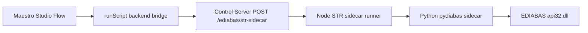

# EDIABAS Sidecar (JS-first) - Complete Runbook

## 1) What this solves
This implementation gives a stable, JS-first STR execution path that works from both CLI and Maestro Studio without relying on manual Tool64 GUI action setup at runtime.

Core idea:
- Maestro/Node handles orchestration.
- Python sidecar (`pydiabas`) performs direct EDIABAS API calls.
- Control server bridges Studio to the same backend command path used by CLI validation.

## 2) Architecture (simple)


Main files:
- `flows/smoke/_smoke_ediabas_str_sidecar.yaml`
- `flows/subflows/ediabas_str_prep_backend.yaml`
- `flows/subflows/ediabas_str_sidecar_backend.yaml`
- `scripts/maestro/ediabas_str_prep_backend.js`
- `scripts/maestro/ediabas_str_sidecar_backend.js`
- `scripts/control_server/server.js`
- `scripts/control_server/ensure_server.bat`
- `scripts/ediabas_str_cycle_sidecar.js`
- `scripts/ediabas_pydiabas_sidecar.py`
- `scripts/requirements-pydiabas-sidecar.txt`

## 3) What was fixed (and why it failed before)
1. Studio backend endpoint added:
   - Added `POST /ediabas/str-sidecar` in `scripts/control_server/server.js`.
   - This lets Studio trigger STR as a backend action.

2. Studio flow path made native (not ACTION-comment dependent):
   - Added optional prep subflow `flows/subflows/ediabas_str_prep_backend.yaml`.
   - Added subflow `flows/subflows/ediabas_str_sidecar_backend.yaml`.
   - Added backend prep script `scripts/maestro/ediabas_str_prep_backend.js`.
   - Added backend script `scripts/maestro/ediabas_str_sidecar_backend.js`.
   - Smoke flow now calls backend subflow directly.

3. Sidecar Python resolution hardened:
   - Problem seen in Studio: plain `python` resolved to Windows Store alias (`exit 9009`).
   - Fix: control server now auto-resolves a valid 32-bit Python path when not explicitly passed.

4. `api32.dll` resolution hardened:
   - Sidecar now auto-discovers DLL path and prepends EDIABAS BIN to `PATH` when needed.

5. `ensure_server.bat` stability fixes:
   - Fixed command quoting.
   - Fixed delayed variable expansion in startup wait loop.
   - Health probe made robust.

## 4) Prerequisites
1. EDIABAS installed (default expected path):
   - `C:\EC-Apps\EDIABAS\BIN`
   - `api32.dll` must exist there.

2. 32-bit Python installed (required by EDIABAS `api32.dll`).

3. Sidecar dependency installed:
```bat
C:\Path\To\Python32\python.exe -m pip install -r scripts\requirements-pydiabas-sidecar.txt
```

4. Optional but recommended env var:
```bat
set PYDIABAS_PYTHON32=C:\Path\To\Python32\python.exe
```

## 5) STR state sequence used
Sequence is deterministic:
- PAD
- WOHNEN
- PARKING
- SLEEP (`str-seconds`)
- WOHNEN
- PAD

Default job/args:
- ECU: `IPB_APP1`
- Job: `STEUERN_ROUTINE`
- PAD: `ARG;ZUSTAND_FAHRZEUG;STR;0x07`
- WOHNEN: `ARG;ZUSTAND_FAHRZEUG;STR;0x05`
- PARKING: `ARG;ZUSTAND_FAHRZEUG;STR;0x01`

## 6) All supported run combinations

### A) Maestro Studio (recommended)
1. Start backend server:
```bat
scripts\control_server\ensure_server.bat
```
2. Run flow in Studio:
   - `flows/smoke/_smoke_ediabas_str_sidecar.yaml`

Optional ADB prep + reboot stage before STR:
- The smoke flow includes a prep subflow that is disabled by default (`PREP_ENABLED="false"`).
- When enabled, it can execute ADB shell command lists before/after reboot.

Prep controls available in flow env:
- `PREP_ENABLED`: `"true"|"false"`
- `PREP_REBOOT`: `"true"|"false"`
- `PREP_TIMEOUT_SECONDS`: per-step timeout
- `PREP_POST_REBOOT_DELAY_SECONDS`: extra delay after `wait-for-device`
- `PREP_BEFORE_SHELL`: shell command list separated by `||` or new lines
- `PREP_AFTER_SHELL`: shell command list separated by `||` or new lines

Example:
```yaml
PREP_ENABLED: "true"
PREP_REBOOT: "true"
PREP_BEFORE_SHELL: "setprop persist.vendor.some.flag 1||settings put global some_key 0"
PREP_AFTER_SHELL: "am broadcast -a com.bmwgroup.SOME_REFRESH"
```

### B) Backend endpoint directly (HTTP)
```powershell
$body=@{ testId='manual_http'; strSeconds=5; settleSeconds=1; timeoutSeconds=90; retries=1; ecu='IPB_APP1'; job='STEUERN_ROUTINE'; argPad='ARG;ZUSTAND_FAHRZEUG;STR;0x07'; argWohnen='ARG;ZUSTAND_FAHRZEUG;STR;0x05'; argParking='ARG;ZUSTAND_FAHRZEUG;STR;0x01' } | ConvertTo-Json -Compress
Invoke-RestMethod -Method Post -Uri 'http://127.0.0.1:4567/ediabas/str-sidecar' -ContentType 'application/json' -Body $body
```

Prep endpoint directly (optional):
```powershell
$prep=@{ testId='manual_prep'; enabled=$true; reboot=$true; timeoutSeconds=30; postRebootDelaySeconds=15; beforeShell=@('setprop persist.vendor.some.flag 1'); afterShell=@('am broadcast -a com.bmwgroup.SOME_REFRESH') } | ConvertTo-Json -Compress
Invoke-RestMethod -Method Post -Uri 'http://127.0.0.1:4567/ediabas/str-prep' -ContentType 'application/json' -Body $prep
```

### C) Node sidecar runner (CLI)
```bat
node scripts\ediabas_str_cycle_sidecar.js --str-seconds 180 --settle-seconds 2
```

### D) Node sidecar runner with explicit Python (most deterministic)
```bat
node scripts\ediabas_str_cycle_sidecar.js --sidecar-python "C:\Path\To\Python32\python.exe" --str-seconds 180 --settle-seconds 2
```

### E) Node sidecar runner with sidecar mode control
- Auto (default): tries HTTP sidecar first, then CLI sidecar.
```bat
node scripts\ediabas_str_cycle_sidecar.js --sidecar-mode auto
```
- Force CLI sidecar:
```bat
node scripts\ediabas_str_cycle_sidecar.js --sidecar-mode cli
```
- Force HTTP sidecar:
```bat
node scripts\ediabas_str_cycle_sidecar.js --sidecar-mode http --sidecar-url http://127.0.0.1:8777
```

### F) Start sidecar HTTP service explicitly
```bat
%PYDIABAS_PYTHON32% scripts\ediabas_pydiabas_sidecar.py serve --host 127.0.0.1 --port 8777
```

### G) Wrapper command
```bat
scripts\run_action.bat ediabas-str-js-sidecar --str-seconds 180 --settle-seconds 2
```

### H) Legacy/alternate engines (still available)
- Python Tool64/Tool32 hybrid runner:
```bat
python scripts\ediabas_str_cycle.py --ediabas-bin "C:\EC-Apps\EDIABAS\BIN"
```
- Node Tool64/Tool32 parity runner:
```bat
node scripts\ediabas_str_cycle.js --ediabas-bin "C:\EC-Apps\EDIABAS\BIN"
```
- Experimental direct API path:
```bat
node scripts\ediabas_str_cycle_api.js --ediabas-bin "C:\EC-Apps\EDIABAS\BIN" --str-seconds 180 --settle-seconds 2
```

## 7) Diagnose and quick checks
Sidecar diagnose:
```bat
node scripts\ediabas_str_cycle_sidecar.js --diagnose --probe --probe-ecu TMODE --probe-job INFO
```

Control server health:
```powershell
Invoke-RestMethod -Method Get -Uri 'http://127.0.0.1:4567/health'
```

Endpoint list:
```powershell
(Invoke-RestMethod -Method Get -Uri 'http://127.0.0.1:4567/').endpoints
```

## 8) Artifacts and where to look when debugging
Backend STR call artifacts:
- `artifacts/runs/<timestamp>/backend/<testId>/ediabas_str_sidecar.json`
- `artifacts/runs/<timestamp>/backend/<testId>/ediabas/ediabas_str_audit.jsonl`
- per-attempt logs, e.g. `.../PAD_attempt2.log`

Useful signals:
- `run.code == 0`: backend launch succeeded.
- JSON `ok == true`: full STR sequence succeeded.
- `exit_code=9009` in attempt log: wrong/missing Python resolution.

## 9) Recommended day-to-day usage
For normal Studio runs:
1. `scripts\control_server\ensure_server.bat`
2. Run `flows/smoke/_smoke_ediabas_str_sidecar.yaml` in Studio.

For CI/CLI reproducibility:
1. Pin and pass explicit Python32 path.
2. Use Node sidecar CLI command with explicit `--sidecar-python`.

## 10) Global preconditions before suites
The suite wrappers now run global preconditions once before all flows:
- `run_suite.bat`
- `run_demo_suite.bat`
- `run_lightning_demo.bat`

Runner-level preconditions are executed by `scripts/maestro/run_with_artifacts.ps1` when enabled.

Environment toggles:
- `MAESTRO_GLOBAL_PRECONDITIONS_ENABLED=true|false` (default in runner: false)
- `MAESTRO_PREP_REBOOT=true|false` (default when enabled: true)
- `MAESTRO_PREP_TIMEOUT_SECONDS` (default: 30)
- `MAESTRO_PREP_POST_REBOOT_DELAY_SECONDS` (default: 35)
- `MAESTRO_PREP_BEFORE_SHELL` (default: CID + PHUD disable setprops)
- `MAESTRO_PREP_AFTER_SHELL` (default: CID + PHUD getprop checks)

Default command pair used when values are not provided:
- before:
   - `setprop persist.vendor.com.bmwgroup.disable_cid_ehh true`
   - `setprop persist.vendor.com.bmwgroup.disable_phud_ehh true`
- after:
   - `getprop persist.vendor.com.bmwgroup.disable_cid_ehh`
   - `getprop persist.vendor.com.bmwgroup.disable_phud_ehh`

